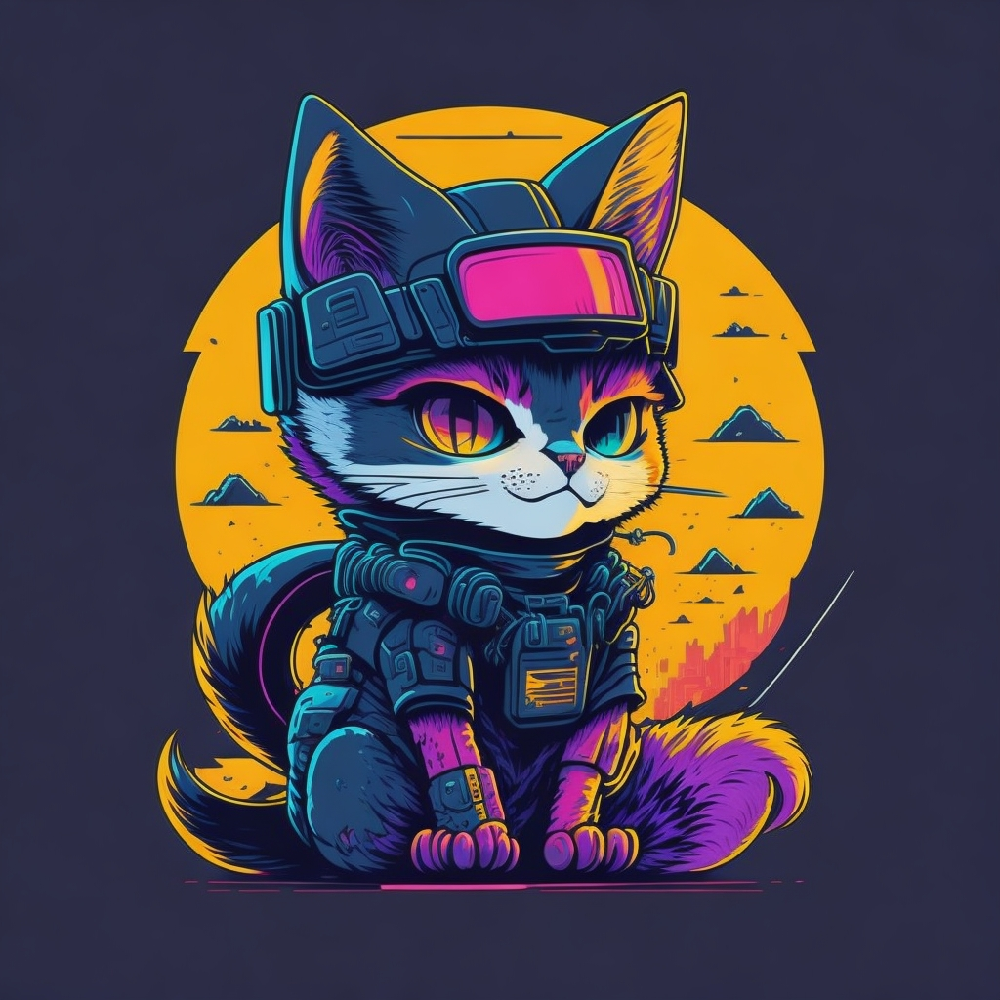

# Neon

## Motivação

A linguagem de programação Neon é uma inovação pioneira na area de desenvolvimento de software, concebida para desafiar e expandir os limites convencionais da programação.

Nossa principal inovação está na incorporação explícita de dois paradigmas que geralmente são subutilizados ou mal interpretados: a programação orientada por eventos e a programação orientada por aspectos. Procuramos desmistificar a o uso de eventos, que costuma ser tratados como um "pesado loop infinito de verificação". Acreditamos que esta é uma visão restritiva e, ao contrário, propomos um tratamento mais sofisticado e eficiente desse paradigma. Além disso, trazendo o AOP para o primeiro plano, permitindo a modificação de código em tempo de execução, um recurso raramente disponível em linguagens compiladas.

Ao mesmo tempo, Neon busca conciliar eficiência e controle de baixo nível com uma sintaxe expressiva e intuitiva. O objetivo é romper a tradicional dicotomia entre linguagens fáceis de usar e linguagens de alto desempenho. Assim, os programadores não precisam sacrificar a legibilidade ou simplicidade para alcançar a performance desejada.

Como linguagem multiparadigma, oferece aos programadores a flexibilidade para adotar a abordagem mais adequada para cada desafio. Isso permite que os desenvolvedores se concentrem em criar soluções eficazes e inovadoras, sem serem sobrecarregados pelos detalhes técnicos.

A linguagem de programação Neon representa um salto em direção a uma nova era de desenvolvimento de software, onde a expressividade, a eficiência e a flexibilidade não são mais mutuamente exclusivas. Esperamos que você se junte a nós nesta jornada emocionante.

## Características principais:

- **Legibilidade e expressividade**: Sintaxe limpa e concisa, projetada para melhorar o entendimento visual do fluxo do código e ao mesmo tempo promover uma escrita natural.
- **Controle de comportamento em tempo de execução**: Permite a modificação do comportamento do programa em tempo de execução, proporcionando maior flexibilidade.
- **Orientação a aspectos e eventos**: Possui mecanismos de disparo de eventos, injeção de comportamento, observadores e um sistema de "pulse", suportando programação orientada a aspectos e eventos.
- **Gerenciamento de memória flexível**: Conta com um sistema de Garbage Collector, mas também permite controle manual da memória quando necessário, incluindo a possibilidade de desligar o coletor.
- **Programação funcional avançada**: Suporta funções lambda, funções de alta ordem e composição de funções.
- **Funções Assembly para otimização**: Permite a incorporação de funções Assembly para otimizações de desempenho em nível baixo.
- **Orientação a objetos com suporte a traits**: Possui um sistema de traits para reutilização de código e polimorfismo, suportando programação orientada a objetos.
- **Controle de fluxo avançado**: Oferece um sistema de observadores robusto e versátil para controle de fluxo de programa.
- **Programação concorrente facilitada**: Conta com um sistema intuitivo de canais de comunicação para suporte a programação concorrente.
- **Controle explícito de ownership**: Implementa um sistema de ownership para controle mais preciso da vida útil das variáveis.
- **Imutabilidade por padrão e controle de permissões**: Implementa imutabilidade por padrão e oferece controle granular sobre as permissões de variáveis através de passagem por referência.
- **Facilidade de interoperação**: Facilita a importação de código de outras linguagens, aprimorando a interoperação.
- **Sistema de erros robusto**: Apresenta um sistema de erros com tratamento explícito, promovendo a robustez do código e a prevenção de falhas.

Neon busca proporcionar uma plataforma eficiente e flexível para a criação de soluções de software altamente eficazes e personalizáveis, com foco na expressividade do código e na facilidade de leitura e escrita para o programador.

## Fase atual do projeto

Estamos atualmente na fase de desenvolvimento ativo do Neon. Estamos trabalhando para estabilizar a linguagem e construir uma comunidade de usuários. Por favor, note que, como estamos em desenvolvimento ativo, algumas funcionalidades podem mudar à medida que avançamos.

Fique de olho em nosso repositório no GitHub para as últimas atualizações e lançamentos.

## Como utilizar:

Como ainda estamos em fase de desenvolvimento iremos atualizar constantemente a distribuição das pastas do projeto, mas atualmente esta dividido entre:

- Sintaxe: Pseudo Codigo de referencia utilizado para criar a definição sintatica
- Exemplos: Codigos reais utilizando neon para visualização da linguagem em pratica
- Referencias: Referencias de implementação internas
- Nyon: Especificações do mascote
- TODO: A ser definido

## Contribuindo

Agradecemos qualquer contribuição para a evolução da linguagem Neon. Existem várias maneiras de contribuir para o projeto:

- Compartilhando conhecimento bibliográfico: Estamos sempre em busca de novos aprendizados e referências bibliográficas que possam enriquecer o projeto. Se você conhece livros, artigos ou qualquer outro recurso que possa ajudar a aprimorar o Neon, sinta-se à vontade para compartilhar conosco através de uma issue no GitHub.
- Reportando bugs: Se você encontrar algum bug ou comportamento inesperado na linguagem, por favor, abra uma issue em nosso GitHub para que possamos investigar e corrigir o problema.
- Sugerindo melhorias: Tem uma ideia para uma nova funcionalidade ou uma sugestão de melhoria? Adoraríamos ouvir! Abra uma issue para discutir suas ideias conosco.
- Contribuindo com código: Se você tem habilidades de programação e gostaria de contribuir com o desenvolvimento do Neon, por favor, faça um fork do nosso repositório e envie um pull request com suas alterações.

Lembre-se de seguir nosso código de conduta ao contribuir. Estamos empenhados em manter um ambiente acolhedor e respeitoso para todos.

## Mascote

A arte oficial ainda sera desenhada de maneira simplificada a partir do seguinte modelo gerado por ia:

